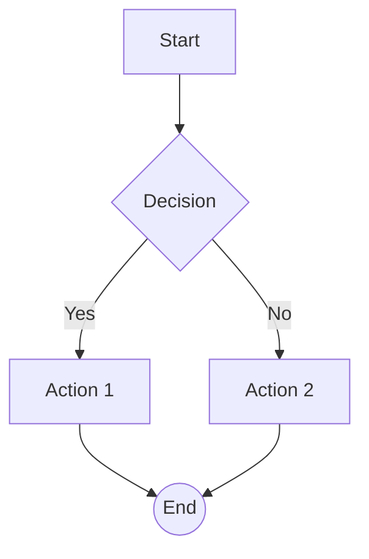

# Mermaid to Google Slides

Convert a [Mermaid](https://mermaid.js.org/) flowchart definition into a diagram on a Google Slide. Nodes become shapes (rectangles, rounded, circles, diamonds, hexagons, etc.) and edges become connector lines.

## Features

- **Flowchart / graph** syntax: `graph TD`, `graph LR`, `flowchart TD`, etc.
- **Node shapes**: `[text]`, `(text)`, `((text))`, `{text}`, `{{text}}`, trapezoid, parallelogram
- **Edges**: `-->`, `---`, `-.->`, `==>`, optional `|label|`
- **Layout**: Automatic hierarchical layout (top-to-bottom or left-to-right)
- **Google Slides API**: Creates a new slide with shapes and connector lines

## Setup

### 1. Google Cloud project

1. Go to [Google Cloud Console](https://console.cloud.google.com/).
2. Create a project or select one.
3. Enable **Google Slides API** and **Google Drive API** (for creating new presentations).
4. Under **APIs & Services → Credentials**, create **OAuth 2.0 Client ID** (Desktop app).
5. Download the JSON and save it as `credentials.json` in this directory.

### 2. Install dependencies

```bash
pip install -r requirements.txt
```

### 3. First run

On first run you’ll be prompted to sign in with Google and allow access. A `token.json` file will be created for future runs.

## Usage

**Create a new presentation and add the diagram:**

```bash
python main.py diagram.mmd
```

**Read Mermaid from stdin:**

```bash
echo "graph TD; A[Start]-->B[Process]; B-->C[End];" | python main.py -
```

**Add the diagram to an existing presentation:**

```bash
python main.py diagram.mmd --presentation-id YOUR_PRESENTATION_ID
```

**Options:**

- `--new` / `-n` – Create a new presentation (default when no `--presentation-id`).
- `--title` / `-t` – Title for a new presentation (default: "Mermaid Diagram").
- `--credentials` – Path to OAuth2 credentials JSON (default: `credentials.json`).
- `--token` – Path to store the OAuth2 token (default: `token.json`).

## Example

**diagram.mmd:**



```bash
python main.py diagram.mmd
```

Opens a new Google presentation with one slide containing the flowchart as shapes and connectors.

## Project structure

- `mermaid_parser.py` – Parses Mermaid source into nodes and edges.
- `layout.py` – Computes node positions (EMU) for the slide.
- `slides_builder.py` – Builds Slides API requests (shapes + lines).
- `main.py` – CLI: auth, create/open presentation, add diagram slide.

## License

MIT
